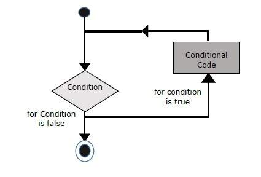

|Bài trước đó|Mục lục|Bài kế tiếp|
|---|---|---|
|[Toán tử](9_Operators.md)|[Mục lục](README.md)|[Đưa ra quyết định](11_DecisionMaking.md)|

# Vòng lặp

Khi viết một hợp đồng, bạn có thể gặp phải một tình huống mà khi bạn thực hiện một hành động lặp lại nhiều lần. Trong tình huống như vậy, bạn có thể cần đến lệnh lặp để giảm số dòng mã.

Solidity hỗ trợ các dạng vòng lặp như sau:

|STT|Tên vòng lặp|Mô tả|Lưu đồ|
|---|---|---|---|
|1|`while (condition) {statement(s) to be executed if condition is true}`|Đây là vòng lặp điển hình trong lập trình. Vòng lặp này thực thi một hoặc nhiều dòng lệnh trong khối lệnh (*code block*) khi điều kiện (*condition*)  **đúng**. Ngược lại, khi điều kiện không thỏa mãn, tức là **sai** thì kết thúc vòng lặp.||
|2|`do {statement(s) to be executed} while (condition);`|Điều khác biệt ở vòng lặp này so với vòng lặp `while` ở trên là điều kiện được kiểm tra sau khi thực thi khối lệnh. Nói các khác, các câu lệnh trong vòng lặp vẫn chạy ít nhất một lần mặc dù điều kiện không thỏa mãn.||
|3|`for (initialization; condition; iteration statement) {statement(s) to be executed if condition is true}`|Vòng lặp này được sử dụng với điều kiện lặp rõ ràng hơn hai vòng lặp trên. Đầu tiên là khởi tạo (*initialize*) biến đếm vòng lặp (*counter*) với giá trị bắt đầu. Sau đó là kiểm tra có thỏa mãn điều kiện ở vế thứ 2 sau dấu chấm phẩy. Nếu thỏa điều kiện thì thực thi khối lệnh. Thực thi xong thì thay đổi giá trị (tăng/giảm) của biến đếm ở vế thứ 3 và kiểm tra điều kiện ở vế thứ 2. Nếu thỏa mãn thì tiếp tục thực hiện khối lệnh, ngược lại thì kết thúc vòng lặp.||

## Điều khiển vòng lặp

Cũng như các ngôn ngữ lập trình khác thì Solidity cũng có các lệnh xử lý (*handle*) lặp và chuyển đổi (*switch*). Giả sử bạn muốn ra khỏi vòng lặp mà không cần đến dòng cuối của khối lệnh, hoặc bạn muốn bỏ qua phần còn lại của khối lệnh và tiếp tục vòng lặp kế tiếp?

Solidity có hai từ khóa để xử lý hai trường hợp trên là **break** và **continue**.

### `break`

Trong đa số các ngôn ngữ thì `break` nằm trong lệnh `switch` dùng để thoát khỏi các trường hợp (*case*). Trong vòng lặp, nó được dùng để kết thúc sớm vòng lặp, ra khỏi các dấu ngoặc nhọn trong vòng lặp bao quanh.

### `continue`

`continue` nói cho trình biên dịch biết là di chuyển ngay lập tực đến vòng lặp kế tiếp mà bỏ qua các lệnh còn lại trong khối lệnh. Như vậy, khi gặp `continue`, dòng chạy (*flow*) của chương trình sẽ đi đến vế thứ 3 của `for`, thay đổi giá trị biến đếm, rồi đến vế thứ 2 kiểm tra điều kiện. Sau đó là thực thi khối lệnh.
