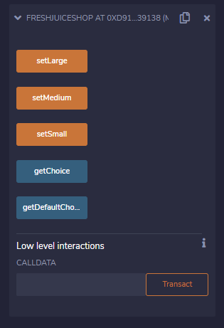
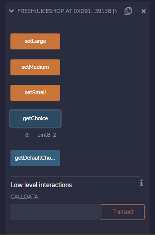
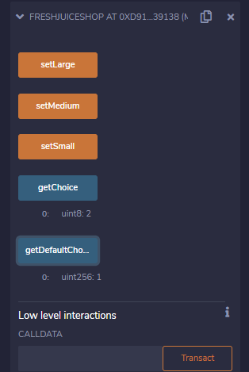

|Bài trước đó|Mục lục|Bài kế tiếp|
|---|---|---|
|[Mảng](13_Arrays.md)|[Mục lục](README.md)|[Struct](15_Structs.md)|

# Enum

Biến `enum` bị hạn chế một vài giá trị được định nghĩa trước, những giá trị này nằm trong danh sách liệt kê (*enumerate*) được gọi là `enum`.

Giả sử một ứng dụng cho cửa hàng bán nước trái cây, khách hàng vào ứng dụng này để đặt hàng. Ứng dụng hạn chế các kích thước ly mà khách hàng có thể chọn vì thực tế cửa hàng chỉ kinh doanh các ly có kích thước như lớn, trung bình và nhỏ. Để đảm bảo khách hàng không thể chọn khác các kích thước trên, người ta sử dụng một `enum`.

## Ví dụ

```solidity
pragma solidity ^0.5.0;

contract FreshJuiceShop {
    enum GlassSize {
        SMALL,
        MEDIUM,
        LARGE
    }

    GlassSize userChoice;
    GlassSize constant defaultChoice = GlassSize.MEDIUM;

    function setLarge() public {
        userChoice = GlassSize.LARGE;
    }

    function setMedium() public {
        userChoice = GlassSize.MEDIUM;
    }

    function setSmall() public {
        userChoice = GlassSize.SMALL;
    }

    function getChoice() public view returns (GlassSize) {
        return userChoice;
    }

    function getDefaultChoice() public pure returns (uint256) {
        return uint256(defaultChoice);
    }
}
```

Sau khi **Deploy** code trên RemixOS sẽ thấy được kết quả như sau:



Giả sử khách hàng nhấn nút **SetLarge**, thì **getChoice** sẽ trả về:



Nếu khách hàng chọn kích thước mặc định, giá trị trả về như sau:


