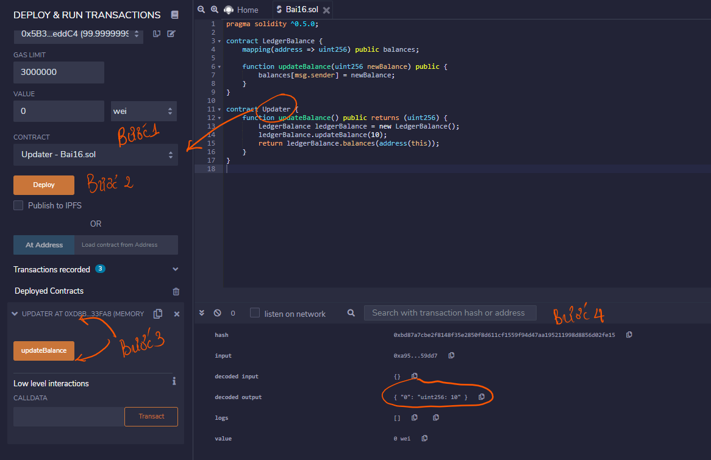

|Bài trước đó|Mục lục|Bài kế tiếp|
|---|---|---|
|[Enum](15_Structs.md)|[Mục lục](README.md)|[Chuyển đổi](17_Conversions.md)|

# Ánh xạ (Mappings)

Ánh xạ là một kiểu tham chiếu dưới dạng mảng và struct có cú pháp là:

```
mapping(_KeyType => _ValueType)
```

Trong đó:

* **_KeyType** - có thể là bất kỳ kiểu có sẵn cộng với byte và string. Không kiểu tham chiếu hoặc các đối tượng phức tạp được chấp nhận.
* **_ValueType** - bất kỳ kiểu nào.

## Chú ý

* Ánh xạ có chỉ có kiểu của **storage** và thường được sử dụng cho các biến trạng thái.
* Ánh xạ có thể là được đánh dấu công khai (*public*). Solidity tự động tạo hàm trả về (*getter*) cho nó.

## Ví dụ

```solidity
pragma solidity ^0.5.0;

contract LedgerBalance {
    mapping(address => uint256) public balances;

    function updateBalance(uint256 newBalance) public {
        balances[msg.sender] = newBalance;
    }
}

contract Updater {
    function updateBalance() public returns (uint256) {
        LedgerBalance ledgerBalance = new LedgerBalance();
        ledgerBalance.updateBalance(10);
        return ledgerBalance.balances(address(this));
    }
}
```

Sau khi biên dịch thành công, để xem kết quả ta làm như sau:



* Bước 1. Chọn hợp đồng là Updater
* Bước 2. Nhấn nút **Deploy**
* Bước 3. Chọn hợp đồng đã triển khai và nhấn nút **updateBalance**
* Bước 4: Trong khu vực Console nhấn vào nút mũi tên bên cạnh nút Debug, kéo xuống dưới sẽ thấy kết quả decoded output như sau:

```
{
	"0": "uint256: 10"
}
```
