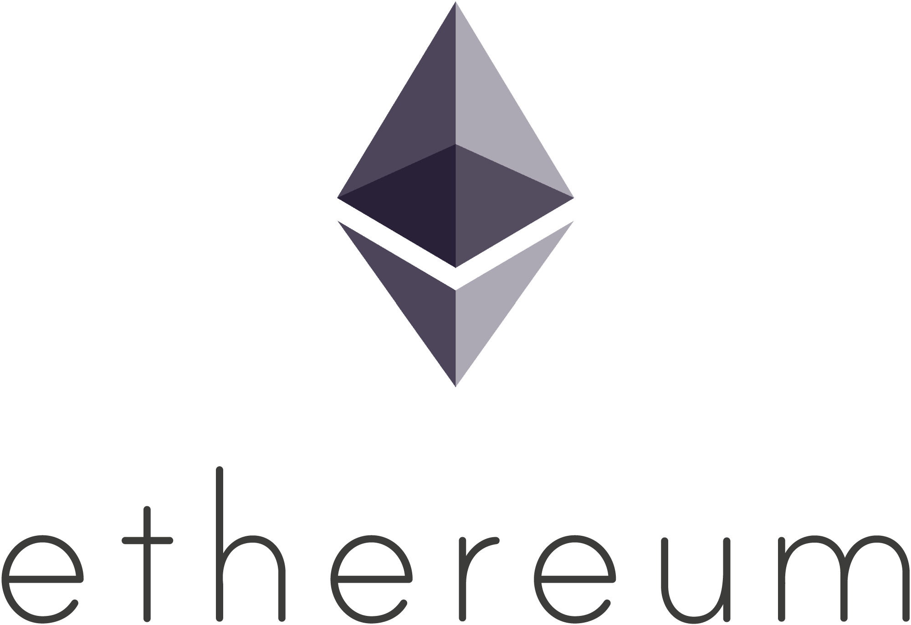
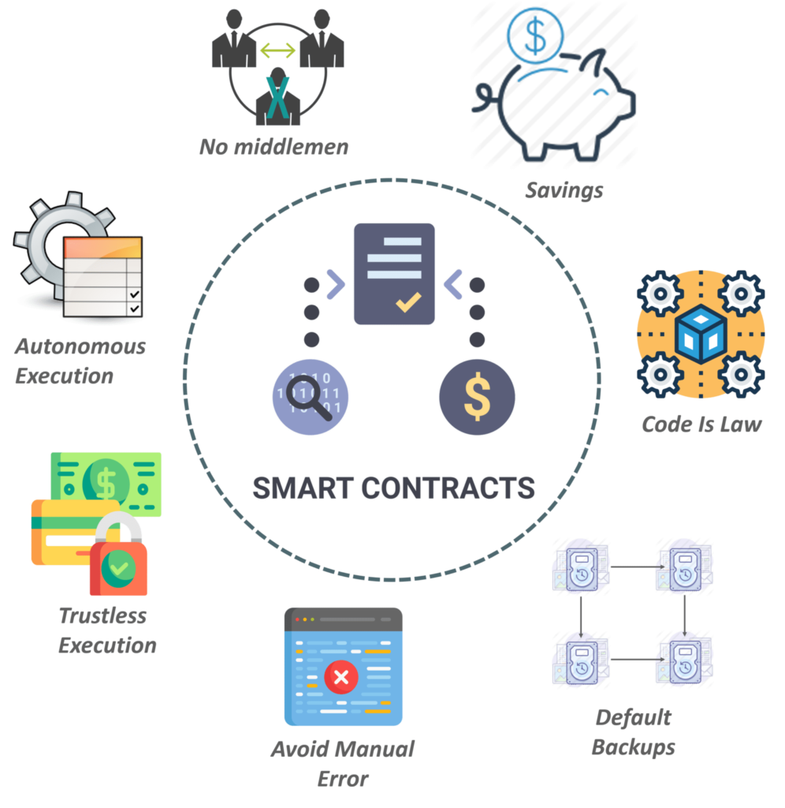

|Bài trước đó|Mục lục|Bài kế tiếp|
|---|---|---|
||[Mục lục](README.md)|[Cài đặt môi trường](2_EnvironmentSetup.md)|

# Bài 1. Tổng quan (Overview)

## Solidity là gì?

Solidity là một ngôn ngữ lập trình bậc cao hướng hợp đồng (*contract-oriented*) dùng cho triển khai các hợp đồng thông minh (*smart contracts*). Solidity chịu sự ảnh hưởng cao từ C++, Python và JavaScript. Nó được thiết kế hướng đến mục tiêu Máy ảo Ethereum (*EVM - Ethereum Virtual Machine*).

Solidity được định kiểu tĩnh (*statically typed*), hỗ trợ kế thừa, thư viện và ngôn ngữ lập trình kiểu người dùng tự định nghĩa phức tạp (*complex user-defined types*).

## Ethereum là gì?

Ethereum là một nền tảng Blockchain phi tập trung (*decentralized platform*) chạy các hợp đồng thông minh - là các ứng dụng mà được lập trình chính xác, *không có bất kỳ* thời gian chết (*downtime*), kiểm duyệt (*censorship*), gian lận (*fraud*) và can thiệp của bên thứ ba.

## Máy ảo Ethereum (EVM)

EVM là môi trường thời gian chạy (*runtime*) cho các hợp đồng thông minh trong Ethereum. EVM trọng tâm vào cung cấp bảo mật và thực thi mã không tin cậy bởi các máy tính trên khắp thế giới.

EVM chuyên ngăn chặn các vụ tấn công từ chối dịch vụ (*DOS - Denial-of-service*) và đảm bảo các chương trình không có quyền truy cập vào trạng thái của nhau, đảm bảo liên lạc có thể được thiết lập mà không cần bất kỳ can thiệp tiềm ẩn nào.

EVM được thiết kế để phục phụ như một môi trường thời gian chạy cho các hợp đồng thông minh dựa trên Ethereum.

## Hợp đồng thông minh là gì?

Một hợp đồng thông minh là một giao thức máy tính hướng đến mục đích đơn giản hóa kỹ thuật số (*digitally facilitate*), xác minh (*verify*) hoặc thực thi đàm phán (*enforce the negotiation*) hoặc thực hiện hợp đồng (*performance of a contract*). Hợp đồng thông minh cho phép thực hiện các giao dịch đáng tin cậy mà không cần bên thứ ba. Những giao dịch này có thể theo dõi (*trackable*) và không thể đảo ngược được (*irreversible*).

Khái niệp hợp đồng thông minh được đề xuất lần đầu bởi Nick Szabo vào năm 1994. Szabo là một học giả pháp lý (*legal scholar*) và nhà mật mã học được biết đến như là người đặt nền móng cho tiền kỹ thuật số.
