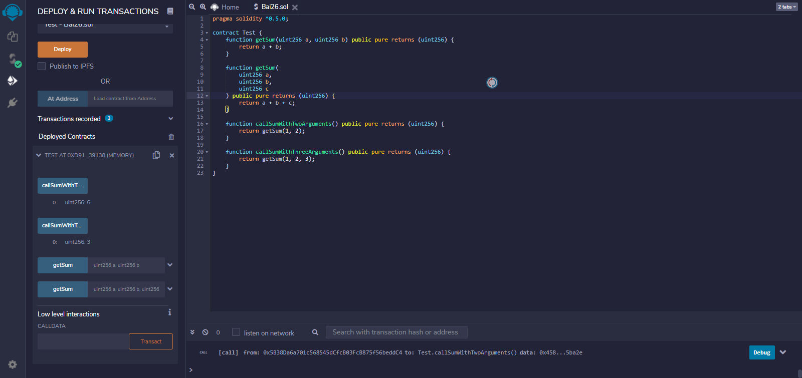

|Bài trước đó|Mục lục|Bài kế tiếp|
|---|---|---|
|[Hàm Fallback](25_FallbackFunctions.md)|[Mục lục](README.md)|[Hàm toán học](27_MathematicalFunctions.md)|

# Quả tải hàm (Overloading)

Bạn có thể định nghĩa nhiều lần cho cùng một tên hàm trong cùng phạm vi. Định nghĩa của hàm phải khác với những hàm khác ở kiểu và/hoặc số lượng đối số. Bạn không thể quá tải hàm mà chỉ khác kiểu trả về được.

## Ví dụ

```solidity
pragma solidity ^0.5.0;

contract Test {
    function getSum(uint256 a, uint256 b) public pure returns (uint256) {
        return a + b;
    }

    function getSum(
        uint256 a,
        uint256 b,
        uint256 c
    ) public pure returns (uint256) {
        return a + b + c;
    }

    function callSumWithTwoArguments() public pure returns (uint256) {
        return getSum(1, 2);
    }

    function callSumWithThreeArguments() public pure returns (uint256) {
        return getSum(1, 2, 3);
    }
}
```

## Kết quả

Nhấn **callSumWithTwoArguments** trước và nhấn nút **callSumWithThreeArguments**  sau.



```
0: uint256: 3
0: uint256: 6
```
