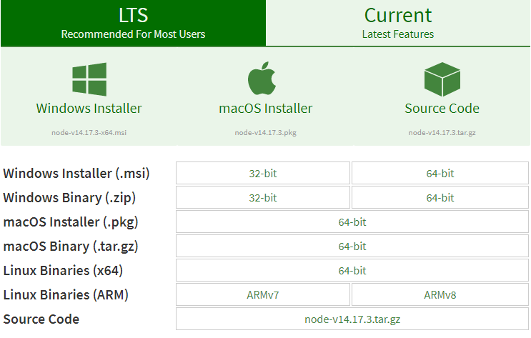
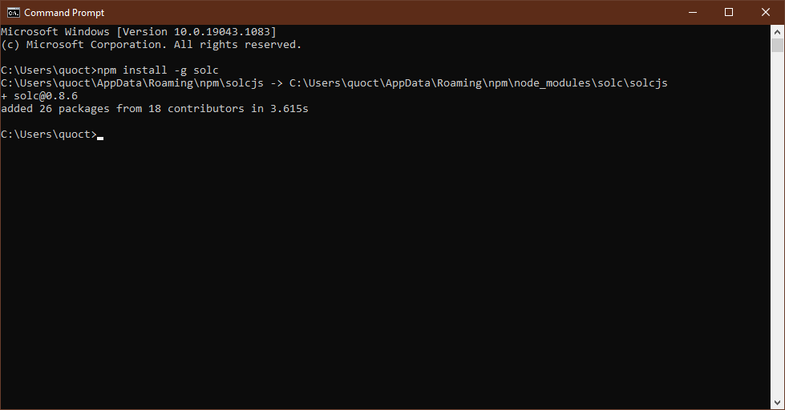
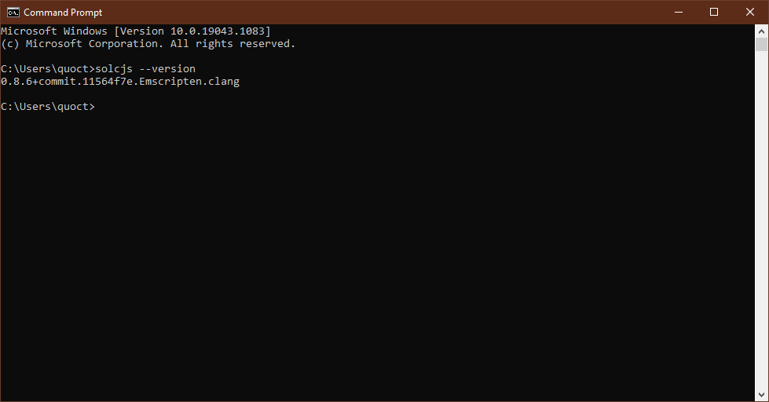
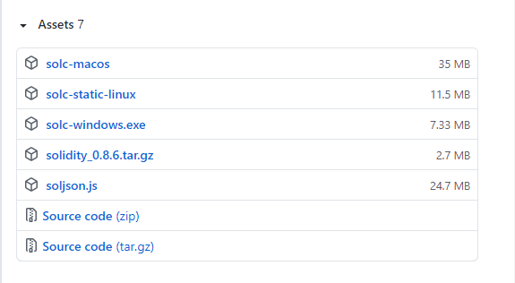
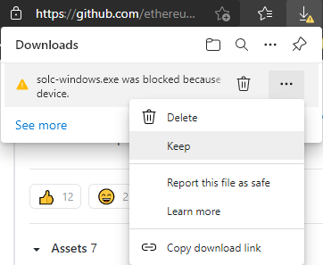
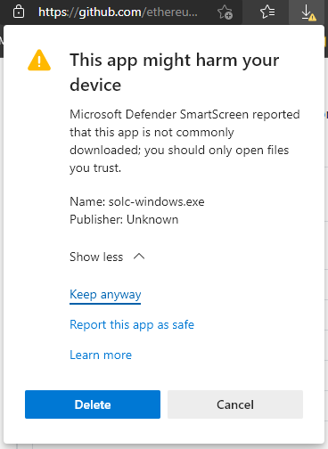
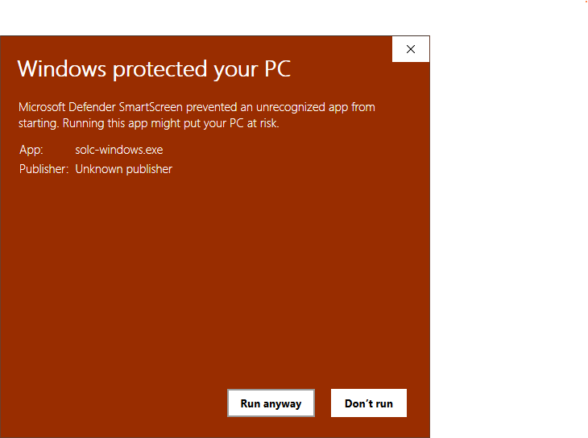
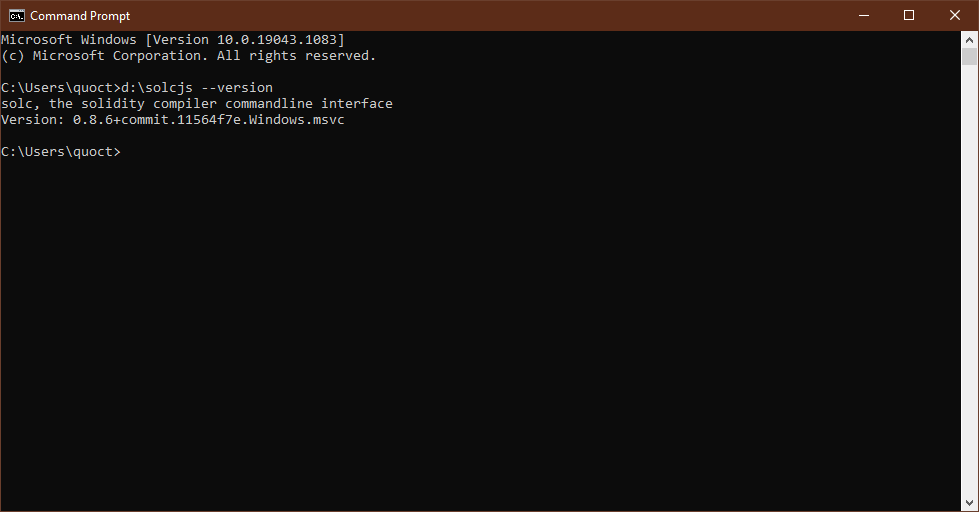

|Bài trước đó|Mục lục|Bài kế tiếp|
|---|---|---|
|[Tổng quan](1_Overview.md)|[Mục lục](README.md)|[Cú pháp cơ bản](3_BasicSyntax.md)|

# Bài 2. Cài đặt môi trường (Environment Setup)

Phần này hướng dẫn các bạn cài đặt trình biên dịch Solidity trên Windows.

## Cài đặt `solc` trên Windows

### Cài đặt thông qua Node.js

#### Cài đặt Node.js

Chọn và tải về trình cài đặt tại đường dẫn [sau](https://nodejs.org/en/download/).



Quá trình cài đặt nên giữ nguyên các thiết lập mặc định. Hướng dẫn cài đặt có thể tham khảo thêm ở trang [này](https://openplanning.net/11921/cai-dat-nodejs-tren-windows).

#### Cài đặt solc

`solc` là trình biên dịch Solidity. Sau khi cài đặt xong Node.js, bạn có thể thực hiện cài đặt bằng dòng lệnh sau:

```bash
npm install -g solc
```



Kiểm tra cài đặt thành công bằng cách kiểm tra phiên bản của `solc` trên cửa sổ Command Prompt:

```bash
solcjs --version
```



### Cài đặt `solc` từ tập tin nhị phân

Truy cập địa chỉ sau [https://github.com/ethereum/solidity/releases](https://github.com/ethereum/solidity/releases). Tìm và tải về phiên bản cài đặt có đuôi *.exe*



Trước khi trình duyệt tải tập tin này sẽ hiện một cảnh báo như sau, chọn **Keep** và **Keep anyway** để xác nhận





Trình biên dịch Solidity chỉ chạy bằng dòng lệnh, nên nếu chạy trực tiếp thì có một cảnh báo như sau và cửa sổ Command Prompt nhanh chóng tắt



Di chuyển tập tin này vào vị trí phù hợp, đổi tên lại (chẳng hạn đổi thành tên mới là `solcjs` và nằm ở ổ D), mở cửa sổ Command Prompt và chạy lệnh sau:

```bash
D:\solcjs --version
```



Tuy nhiên, nếu cài đặt `solc` theo cách này, mỗi lần muốn biên dịch chương trình thì phải dẫn đến đường dẫn của tập tin .exe của `solc` khá là phiền phức. Cách giải quyết là đưa đường dẫn đến tập tin `solc` (tên mới đổi lại là `solcjs`) vào biến môi trường, chi tiết hướng dẫn xem tại trang web [này](https://www.codeooze.com/blockchain/solc-hello-world/).

Ngoài ra còn có một vài cách cài đặt khác nhưng không đề cập trong này. Có thể xem bài gốc tại [đây](https://www.tutorialspoint.com/solidity/solidity_environment_setup.htm).
