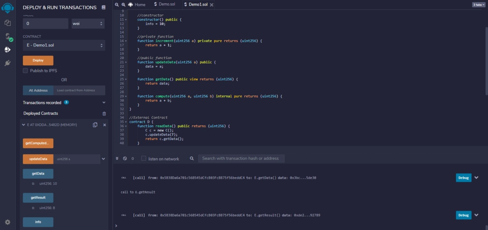

|Bài trước đó|Mục lục|Bài kế tiếp|
|---|---|---|
|[Mẫu hạn chế](30_RestrictedAccess.md)|[Mục lục](README.md)|[Kế thừa](32_Inheritance.md)|

# Hợp đồng (Contracts)

Hợp đồng trong Solidity tương tự như một lớp trong C++. Một hợp đồng có các thuộc tính sau:

* **Hàm khởi tạo (*Constructor*)**: Một hàm đặc biệt được khai báo với từ khóa `contructor` sẽ được thực thi mỗi hợp đồng và được gọi khi một hợp đồng được khai báo.
* **Các biến trạng thái (*State variables*)**: Các biến mỗi hợp đồng lưu trữ trạng thái của hợp đồng.
* **Hàm (*Functions*)**: Các hàm mỗi hợp đồng mà có thể chỉnh sửa các biến trạng thái để thay thế trạng thái của một hợp đồng.

## Phạm vi truy cập

Dưới đây là các phạm vi truy cập dành cho hàm/các biến trạng thái của một hợp đồng.

* **external**: Các hàm *external* có nghĩa là được gọi bởi các hợp đồng khác. Chúng không thể được dùng cho lời gọi nội bộ. Các biến trạng thái không thể được đánh dấu là *external*.
* **public**: Các hàm/biến *public* có thể được sử dụng cho cả bên ngoài và bên trong. Đối với biến trạng thái *public*, Solidity tự động tạo hàm *getter*.
* **internal**: Các hàm/biến *internal* chỉ có thể được sử dụng nội bộ hoặc bởi các hợp đồng dẫn xuất.
* **private**: Các hàm/biến private chỉ có thể được sử dụng nội bộ và không thể gọi từ các hợp đồng dẫn xuất.

## Ví dụ

```solidity
pragma solidity ^0.5.0;

contract C {
    //private state variable
    uint256 private data;

    //public state variable
    uint256 public info;

    //constructor
    constructor() public {
        info = 10;
    }

    //private function
    function increment(uint256 a) private pure returns (uint256) {
        return a + 1;
    }

    //public function
    function updateData(uint256 a) public {
        data = a;
    }

    function getData() public view returns (uint256) {
        return data;
    }

    function compute(uint256 a, uint256 b) internal pure returns (uint256) {
        return a + b;
    }
}

//External Contract
contract D {
    function readData() public returns (uint256) {
        C c = new C();
        c.updateData(7);
        return c.getData();
    }
}

//Derived Contract
contract E is C {
    uint256 private result;
    C private c;

    constructor() public {
        c = new C();
    }

    function getComputedResult() public {
        result = compute(3, 5);
    }

    function getResult() public view returns (uint256) {
        return result;
    }

    function getData() public view returns (uint256) {
        return c.info();
    }
}
```

## Kết quả

Deploy hợp đồng E rồi nhấn nút **getComputedResult** trước, sau đó nhấn **getResult**.



```
0: uint256: 8
```
