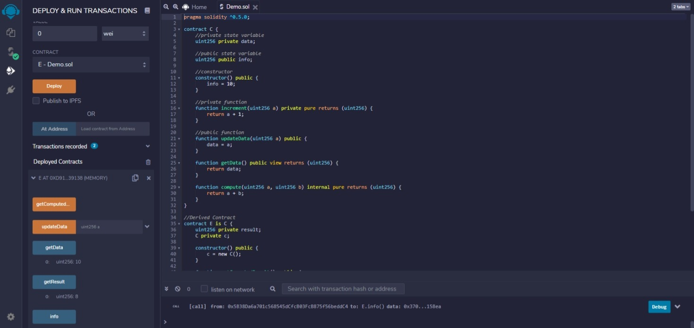

|Bài trước đó|Mục lục|Bài kế tiếp|
|---|---|---|
|[Hợp đồng](31_Contracts.md)|[Mục lục](README.md)|[Hàm khởi tạo](33_Constructors.md)|

# Kế thừa (Inheritance)

Kế thừa là một cách mở rộng chức năng của một hợp đồng. Solidity hỗ trợ cả đơn kế thừa (*single inheritance*) và đa kế thừa (*multiple inheritance*).

* Một hợp đồng dẫn xuất có thể truy cập đến tất cả các thành viên không phải `private` bao gồm các phương thức nội bộ và các biến trạng thái. Nhưng sử dụng `this` thì không được.
* Ghi đè hàm được cho phép với điều kiện chữ ký hàm vẫn giữ nguyên. Trong trường hợp có các tham số đầu ra khác nhau, quá trình biên dịch sẽ lỗi.
* Chúng ta có thể gọi một hàm của hợp đồng cha (*super contract*) sử dụng từ khóa `super` hoặc sử dụng tên hợp đồng cha.
* Trong trường hợp đa kế thừa, việc gọi hàm sử dụng `super` ưu tiên cho hầu hết các hợp đồng dẫn xuất.

## Ví dụ

```solidity
pragma solidity ^0.5.0;

contract C {
    //private state variable
    uint256 private data;

    //public state variable
    uint256 public info;

    //constructor
    constructor() public {
        info = 10;
    }

    //private function
    function increment(uint256 a) private pure returns (uint256) {
        return a + 1;
    }

    //public function
    function updateData(uint256 a) public {
        data = a;
    }

    function getData() public view returns (uint256) {
        return data;
    }

    function compute(uint256 a, uint256 b) internal pure returns (uint256) {
        return a + b;
    }
}

//Derived Contract
contract E is C {
    uint256 private result;
    C private c;

    constructor() public {
        c = new C();
    }

    function getComputedResult() public {
        result = compute(3, 5);
    }

    function getResult() public view returns (uint256) {
        return result;
    }

    function getData() public view returns (uint256) {
        return c.info();
    }
}
```

## Kết quả

**Deploy** hợp đồng E, nhấn nút **getComputedResult** và sau đó nhấn nút **getResult**.



```
0: uint256: 8
```
