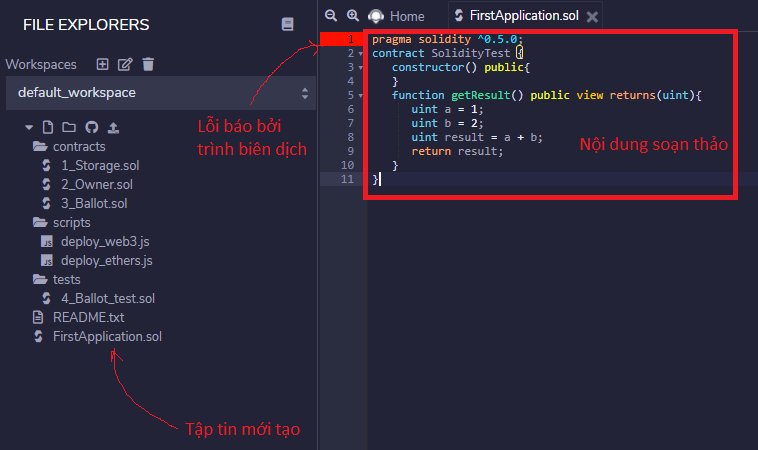
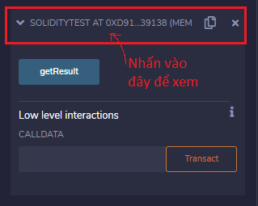
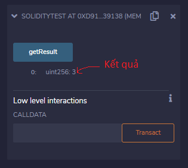

|Bài trước đó|Mục lục|Bài kế tiếp|
|---|---|---|
|[Cú pháp cơ bản](3_BasicSyntax.md)|[Mục lục](README.md)|[Ghi chú](5_Comments.md)|

# Ứng dụng đầu tiên (First Application)

Sử dụng [Remix IDE](https://remix.ethereum.org/) để **Compile (*Biên dịch*)** và **Run (*Chạy*)** mã cơ sở Solidity.


## Ví dụ

```solidity
pragma solidity >=0.5.0;

contract SolidityTest {
    constructor() public{
    }

    function getResult() public view returns(uint){
        uint a = 1;
        uint b = 2;
        uint result = a + b;
        return result;
    }
}
```

## Các bước chạy Solidity trên Remix IDE

1. Tạo một tập tin .sol mới


2. Sao chép đoạn mã trên vào khu vực soạn thảo của Remix IDE




3. Ở menu *Solidity Compiler*, nhấn vào nút **Compile <tên_file>.sol**


4. Ở menu *Deploy & run Transactions*, nhấn vào nút **Deploy**


5. Nhấn vào danh sách thả xuống có chữ **SOLIDITYTEST AT 0X...**



6. Nhấn vào nút **getResult** để xem kết quả



### Kết quả

```
0: uint256: 3
```
