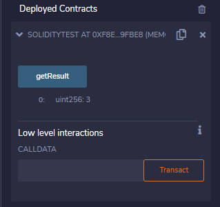

|Bài trước đó|Mục lục|Bài kế tiếp|
|---|---|---|
|[Kiểu](6_Types.md)|[Mục lục](README.md)|[Phạm vi biến](8_VariableScope.md)|

# Biến (Variables)

Solidity hỗ trợ ba loại biến sau:

* **Biến trạng thái (*State Variables*)** - Các biến mà giá trị của chúng được lưu trữ vĩnh viễn trong một bộ nhớ hợp đồng.

* **Biến cục bộ (*Local Variables*)** - Các biến mà giá trị của chúng hiện diện khi khi hàm đang thực thi.

* **Biến toàn cục (*Global Variables*)** - Các biến đặc biệt tồn tại trong không gian tên toàn cục (*global namespace*) dùng để lấy thông tin về chuỗi khối.

## Biến trạng thái

```solidity
pragma solidity ^0.5.0;

contract SolidityTest {
    uint storedData;      // State variable

    constructor() public {
        storedData = 10;   // Using State variable
    }
}
```

## Biến cục bộ

```solidity
pragma solidity ^0.5.0;

contract SolidityTest {
    uint storedData; // State variable

    constructor() public {
        storedData = 10;   
    }

    function getResult() public view returns(uint){
        uint a = 1; // local variable
        uint b = 2;
        uint result = a + b;
        return result; //access the local variable
    }
}
```

Ví dụ:

```solidity
pragma solidity ^0.5.0;

contract SolidityTest {
    uint storedData; // State variable

    constructor() public {
        storedData = 10;   
    }
    
    function getResult() public view returns(uint){
        uint a = 1; // local variable
        uint b = 2;
        uint result = a + b;
        return result; //access the local variable
    }
}
```

Kết quả:



```
0: uint256: 10
```

## Biến toàn cục

<table class="table table-bordered" style="text-align:center;">
<tbody><tr>
<th width="50%">Tên</th>
<th>Trả về</th>
</tr>
<tr>
<td>blockhash(uint blockNumber) returns (bytes32)</td>
<td>Mã băm của khối đã cho - chỉ làm việc với 256 khối gần nhất, ngoại trừ các khối hiện tại</td>
</tr>
<tr>
<td>block.coinbase (address payable)</td> 
<td>Địa chỉ của miner khối hiện tại</td>
</tr>
<tr>
<td>block.difficulty (uint)</td>
<td>Độ khó khối hiện tại</td>
</tr>
<tr>
<td>block.gaslimit (uint)</td>
<td>Giới hạn gas (*gas limit*) khối hiện tại</td>
</tr>
<tr>
<td>block.number (uint)</td>
<td>Số khối hiện tại</td>
</tr>
<tr>
<td>block.timestamp (uint)</td>
<td>Dấu thời gian khối hiện tại theo giây kể từ unix epoch</td>
</tr>
<tr>
<td>gasleft() returns (uint256)</td>
<td>Gas còn lại</td>
</tr>
<tr>
<td>msg.data (bytes calldata)</td>
<td>Calldata hoàn chỉnh</td>
</tr>
<tr>
<td>msg.sender (address payable)</td>
<td>Người gửi thông điệp (người gọi hiện tại)</td>
</tr>
<tr>
<td>msg.sig (bytes4)</td>
<td>4 byte đầu tiên của calldata (mã định danh hàm)</td>
</tr>
<tr>
<td>msg.value (uint)</td>
<td>Số lượng wei đã gửi với thông điệp</td>
</tr>
<tr>
<td>now (uint)</td>
<td>Dấu thời gian khối hiện tại</td>
</tr>
<tr>
<td>tx.gasprice (uint)</td>
<td>Giá gas của giao dịch</td>
</tr>
<tr>
<td>tx.origin (address payable)</td>
<td>Người gửi giao dịch</td>
</tr>
</tbody></table>

## Tên biến

Tên các biến trong Solidity tuân theo các quy tắc sau:

* Không sử dụng các từ khóa như là tên biến. Chẳng hạn: *break*, *boolean* là các tên biến không hợp lệ

* Tên biết không được bắt đầu bằng một số (0-9) mà bắt đầu bằng một chữ cái hoặc dấu gạch dưới. Chẳng hạn: *123test* là tên biến không hợp lệ, *_123test* là tên biến hợp lệ

* Tên biến trong Solodity phân biệt chữ hoa, do đó, *Name* và *name* là hai tên biến khác nhau
