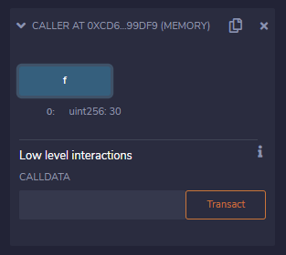

|Bài trước đó|Mục lục|Bài kế tiếp|
|---|---|---|
|[Biến](7_Variables.md)|[Mục lục](README.md)|[Toán tử](9_Operators.md)|

# Phạm vi biến (Variable Scope)

Phạm vi biến cục bộ giới hạn ở hàm mà nó được định nghĩa nhưng biến trạng thái thì có ba loại phạm vi như sau:

* **Public** - Các biến trạng thái công khai có thể được truy cập nội bộ cũng như qua các thông điệp. Với một biến trạng thái công khai, hàm trả giá trị (*getter*) được tự động tạo.

* **Internal** - Các biến trạng thái nội bộ chỉ có thể được truy cập nội bộ từ hợp đồng hiện tại hoặc hợp đồng dẫn xuất từ nó mà không sử dụng *this*.

* **Private** - Các biến trạng thái riêng tư chỉ có thể được truy cập nội bộ từ hợp đồng hiện tại mà nó định nghĩa và không thể trong hợp đồng dẫn xuất từ nó.

## Ví dụ

```solidity
pragma solidity ^0.5.0;

contract C {
    uint public data = 30;
    uint internal iData= 10;
   
    function x() public returns (uint) {
        data = 3; // internal access
        return data;
    }
}


contract Caller {
    C c = new C();

    function f() public view returns (uint) {
        return c.data(); //external access
    }
}


contract D is C {
    function y() public returns (uint) {
        iData = 3; // internal access
        return iData;
    }

    function getResult() public view returns(uint){
        uint a = 1; // local variable
        uint b = 2;
        uint result = a + b;
        return result; //access the state variable
    }
}
```

## Kết quả

### Hợp đồng C

*Trạng thái của `data` lần đầu*


*Trạng thái của `data` sau khi gọi hàm `x()`*


### Hợp đồng Caller

*Trạng thái sau khi gọi hàm `f()`*



### Hợp đồng D

*Trạng thái của `data` và `getResult()` lần đầu*


*Trạng thái của `data` sau khi gọi hàm `x()`*


